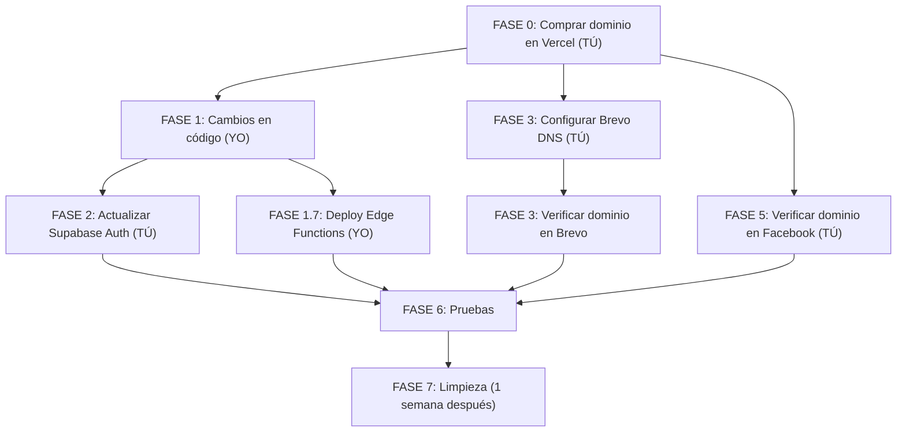

# 🌐 Plan de Migración de Dominio

**De:** `work-english-platform.vercel.app`  
**A:** `englishforworkapp.com`

---

## 📋 Resumen de Impacto

Se identificaron **todos** los lugares donde el dominio actual está hardcodeado o configurado:

| Categoría | Archivos/Servicios afectados | Cantidad |
|---|---|---|
| Supabase Edge Functions | `hotmart-webhook`, `send-drip-emails`, `invite-beta-user` | 3 funciones, ~8 referencias |
| Variables de entorno | `.env`, `.env.example` | 2 archivos |
| Datos de Ads | `src/data/ads/ad-campaigns.json` | 10 URLs |
| Brand config | `config/brand.json` | 1 email de contacto |
| Supabase Auth (dashboard) | Site URL + Redirect URLs | 2 configuraciones |
| Brevo | Sender domain + identidad verificada | 2 configuraciones |
| Hotmart | Webhook URL | 1 configuración |
| Facebook | Pixel domain + Ad URLs | 2 configuraciones |
| Vercel | Custom domain | 1 configuración |

> [!IMPORTANT]
> El dominio actual del frontend usa `window.location.origin` en `auth.js` para redirects de reset password, por lo que **no necesita cambio en código**. Pero las Edge Functions tienen el URL **hardcodeado** y sí necesitan actualización.

---

## FASE 0 — Comprar el dominio en Vercel (TÚ)

> [!NOTE]
> Esto lo debes hacer tú manualmente en el dashboard de Vercel.

### Paso a paso para comprar `englishforworkapp.com` en Vercel:

1. **Ir a** [vercel.com/dashboard](https://vercel.com/dashboard)
2. **En la barra lateral izquierda**, haz clic en **"Domains"** (o ve directo a `vercel.com/domains`)
3. **En el buscador**, escribe: `englishforworkapp.com`
4. Vercel te mostrará si está disponible y el precio anual
5. **Haz clic en "Buy"** y completa el pago con tu tarjeta
6. ✅ Vercel automáticamente configura DNS, SSL, etc.

### Paso a paso para conectar el dominio al proyecto:

1. **Ir a tu proyecto** en Vercel → click en el proyecto `work-english-platform`
2. **Settings** → **Domains**
3. **Add Domain** → escribe `englishforworkapp.com`
4. Vercel te mostrará la configuración DNS — como compraste el dominio en Vercel mismo, **se configura automáticamente**
5. **También agrega** `www.englishforworkapp.com` y configúralo como redirect a `englishforworkapp.com`
6. Espera ~2-5 minutos hasta que el SSL esté activo (Vercel muestra ✅)
7. **Verifica** abriendo `https://englishforworkapp.com` en tu navegador — debe cargar la app

> [!TIP]
> El dominio anterior `work-english-platform.vercel.app` **seguirá funcionando** como redirect automático. No se perderá tráfico.

### ⬜ Checklist Fase 0 (tú haces esto):
- [ ] Dominio `englishforworkapp.com` comprado en Vercel
- [ ] Dominio conectado al proyecto `work-english-platform`
- [ ] `www.englishforworkapp.com` redirige a `englishforworkapp.com`
- [ ] SSL activo (candado verde en el navegador)
- [ ] Confirmar que `https://englishforworkapp.com` carga la app correctamente

---

## FASE 1 — Cambios en el Código (yo hago esto)

### 1.1 Actualizar Edge Function: `hotmart-webhook`
**Archivo:** [hotmart-webhook/index.ts](file:///c:/Users/mgher/Documents/PROYECTOS%20PROGRAMACION/ANTIGRAVITY/work-english-platform/supabase/functions/hotmart-webhook/index.ts)

```diff
-const APP_URL = 'https://work-english-platform.vercel.app'
+const APP_URL = 'https://englishforworkapp.com'
```

- [ ] `APP_URL` actualizado (línea 14)

### 1.2 Actualizar Edge Function: `send-drip-emails`
**Archivo:** [send-drip-emails/index.ts](file:///c:/Users/mgher/Documents/PROYECTOS%20PROGRAMACION/ANTIGRAVITY/work-english-platform/supabase/functions/send-drip-emails/index.ts)

```diff
-const APP_URL = "https://work-english-platform.vercel.app";
+const APP_URL = "https://englishforworkapp.com";
```

- [ ] `APP_URL` actualizado (línea 7)

### 1.3 Actualizar Edge Function: `invite-beta-user`
**Archivo:** [invite-beta-user/index.ts](file:///c:/Users/mgher/Documents/PROYECTOS%20PROGRAMACION/ANTIGRAVITY/work-english-platform/supabase/functions/invite-beta-user/index.ts)

```diff
-const APP_URL = "https://work-english-platform.vercel.app";
+const APP_URL = "https://englishforworkapp.com";
```

```diff
-<a href="${APP_URL}" style="color:#6366f1">work-english-platform.vercel.app</a>
+<a href="${APP_URL}" style="color:#6366f1">englishforworkapp.com</a>
```

- [ ] `APP_URL` actualizado (línea 15)
- [ ] Texto visible del footer del email actualizado (línea 114)

### 1.4 Actualizar Variables de Entorno

**Archivo:** [.env](file:///c:/Users/mgher/Documents/PROYECTOS%20PROGRAMACION/ANTIGRAVITY/work-english-platform/.env)

```diff
-VITE_APP_URL=
+VITE_APP_URL=https://englishforworkapp.com
```

**Archivo:** [.env.example](file:///c:/Users/mgher/Documents/PROYECTOS%20PROGRAMACION/ANTIGRAVITY/work-english-platform/.env.example)

```diff
-VITE_APP_URL=https://englishforwork.com
+VITE_APP_URL=https://englishforworkapp.com
```

- [ ] `.env` actualizado
- [ ] `.env.example` actualizado

### 1.5 Actualizar Ad Campaigns JSON
**Archivo:** [ad-campaigns.json](file:///c:/Users/mgher/Documents/PROYECTOS%20PROGRAMACION/ANTIGRAVITY/work-english-platform/src/data/ads/ad-campaigns.json)

Reemplazar **todas** las 10 ocurrencias:
```diff
-https://work-english-platform.vercel.app/
+https://englishforworkapp.com/
```

- [ ] 10 URLs actualizadas en ad-campaigns.json

### 1.6 Actualizar Vercel Environment Variables

> [!NOTE]
> Si no tienes `VITE_APP_URL` en Vercel dashboard, lo agrego al hacer deploy. Pero si ya existe, tú también puedes cambiarlo manualmente (ver Fase 2.2 abajo).

- [ ] Variable de entorno actualizada en Vercel dashboard

### 1.7 Re-deploy y Re-deploy Edge Functions

- [ ] `npm run build` y deploy a Vercel (o push a GitHub)
- [ ] `supabase functions deploy hotmart-webhook --no-verify-jwt`
- [ ] `supabase functions deploy send-drip-emails`
- [ ] `supabase functions deploy invite-beta-user`

---

## FASE 2 — Cambios en Supabase Auth (TÚ — guía detallada para novato)

> [!IMPORTANT]
> **¿Qué es esto y por qué importa?**
> Supabase Auth usa un "Site URL" para saber a dónde redirigir a los usuarios después de:
> - Confirmar su email
> - Usar un magic link
> - Hacer clic en "recuperar contraseña"
> - Entrar por primera vez desde el email de bienvenida de Hotmart
>
> Si NO cambias esto, los links en los emails seguirán apuntando al dominio viejo de Vercel.

### 📍 Paso a paso super detallado:

**1. Abre el dashboard de Supabase:**
   - Ve a [supabase.com/dashboard](https://supabase.com/dashboard)
   - Inicia sesión con tu cuenta (Google o email)
   - Haz clic en tu proyecto **"English for Work"** (el que tiene ID `mtobgwfknefjlpoxznqx`)

**2. Navega a la configuración de Auth:**
   - En la barra lateral izquierda, busca el ícono de **llave** 🔑 que dice **"Authentication"**
   - Haz clic en él
   - En el submenú que aparece, haz clic en **"URL Configuration"**
   - (O ve directo a: `https://supabase.com/dashboard/project/mtobgwfknefjlpoxznqx/auth/url-configuration`)

**3. Cambiar el Site URL:**
   - Verás un campo que dice **"Site URL"**
   - Actualmente probablemente dice: `https://work-english-platform.vercel.app`
   - **Borra** ese texto y escribe: `https://englishforworkapp.com`
   - ⚠️ **No pongas** barra al final (`/`). Solo: `https://englishforworkapp.com`

**4. Agregar Redirect URL nuevo:**
   - Más abajo verás una sección que dice **"Redirect URLs"**
   - Haz clic en **"Add URL"**
   - Escribe: `https://englishforworkapp.com/**`
   - Los dos asteriscos (`**`) significan "cualquier ruta dentro del dominio"
   - Haz clic en **"Add URL"** para confirmar

**5. Mantener el redirect viejo (temporal):**
   - **NO borres** todavía el redirect de `https://work-english-platform.vercel.app/**` si existe
   - Déjalo por 1 semana como respaldo, por si alguien tiene un email viejo con un link pendiente
   - Lo borraremos en la Fase 7

**6. Guardar:**
   - Haz clic en **"Save"** (botón verde abajo)
   - Verás un mensaje de confirmación

### ⬜ Checklist Fase 2:
- [ ] Site URL cambiado a `https://englishforworkapp.com`
- [ ] Redirect URL `https://englishforworkapp.com/**` agregado
- [ ] Redirect URL viejo `https://work-english-platform.vercel.app/**` se mantiene (temporal)
- [ ] Cambios guardados ✅

---

## FASE 3 — Cambios en Brevo (TÚ — guía detallada para novato)

> [!IMPORTANT]
> **¿Qué es esto y por qué importa?**
> Brevo es el servicio que envía todos los emails de la plataforma:
> - Email de **bienvenida** cuando alguien compra en Hotmart
> - Emails **diarios** (drip) de motivación (día 0, 1, 3, 5, 7)
> - Email de **recuperación de contraseña**
> - Email de **invitación beta**
>
> Para que Gmail, Outlook, etc. confíen en tus emails y NO los manden a spam, necesitas **verificar tu dominio** en Brevo. Esto le dice a Gmail: "Sí, `englishforworkapp.com` autorizó a Brevo a enviar emails en su nombre."

### 📍 Paso 3.1 — Verificar el dominio en Brevo

**1. Abre Brevo:**
   - Ve a [app.brevo.com](https://app.brevo.com)
   - Inicia sesión con tu cuenta

**2. Ve a la configuración de dominios:**
   - En la esquina superior derecha, haz clic en tu **nombre/avatar**
   - Haz clic en **"Senders, Domains & Dedicated IPs"**
   - (O ve directo desde el menú: Settings → Senders & Domains)
   - Haz clic en la pestaña **"Domains"**

**3. Agregar tu dominio nuevo:**
   - Haz clic en **"Add a domain"**
   - Escribe: `englishforworkapp.com`
   - Haz clic en **"Save"** o **"Add"**

**4. Brevo te mostrará registros DNS para agregar:**
   Verás una pantalla con algo como esto:

   | Tipo | Nombre/Host | Valor |
   |---|---|---|
   | TXT | `@` | `v=spf1 include:sendinblue.com ~all` |
   | CNAME | `mail._domainkey` | `(algo largo).dkim.sendinblue.com` |
   | TXT | `_dmarc` | `v=DMARC1; p=none` |

   📸 **Toma un screenshot o deja esta pestaña abierta**, porque ahora vas a agregar esto en Vercel.

**5. Agregar los DNS records en Vercel:**
   - Abre otra pestaña: [vercel.com/dashboard](https://vercel.com/dashboard)
   - Haz clic en **"Domains"** en la barra lateral
   - Busca `englishforworkapp.com` y haz clic en él
   - Verás la sección de **"DNS Records"**
   - Para cada registro que Brevo te pidió:

   **Registro SPF (TXT):**
   - Haz clic en **"Add Record"**
   - Type: **TXT**
   - Name: déjalo vacío (o pon `@`)
   - Value: pega el valor que Brevo te dio (algo como `v=spf1 include:sendinblue.com ~all`)
   - Haz clic en **"Add"**

   **Registro DKIM (CNAME):**
   - Haz clic en **"Add Record"**
   - Type: **CNAME**
   - Name: `mail._domainkey` (o lo que Brevo diga)
   - Value: pega el valor largo que Brevo te dio
   - Haz clic en **"Add"**

   **Registro DMARC (TXT) — opcional pero recomendado:**
   - Haz clic en **"Add Record"**
   - Type: **TXT**
   - Name: `_dmarc`
   - Value: `v=DMARC1; p=none`
   - Haz clic en **"Add"**

**6. Volver a Brevo y verificar:**
   - Regresa a la pestaña de Brevo
   - Haz clic en **"Authenticate this domain"** o **"Verify"**
   - Si los DNS aún no han propagado, verás un mensaje amarillo. **Es normal.**
   - La propagación DNS puede tomar entre **10 minutos y 48 horas**
   - Puedes volver más tarde y hacer clic en "Verify" de nuevo

**7. ¿Cómo saber si funcionó?**
   - Cuando todo esté correcto, Brevo mostrará **✅ verde** junto a cada registro
   - Verás algo como: "Domain authenticated" o "Verified"

### 📍 Paso 3.2 — Crear sender con el nuevo dominio (OPCIONAL — fase futura)

> [!NOTE]
> Esto es **100% opcional ahora**. Solo necesitas hacerlo si quieres enviar emails desde `hola@englishforworkapp.com` en vez de `englishforworkapp@gmail.com`.
> 
> **Recomendación:** Primero verificar el dominio (paso 3.1). El cambio de sender lo podemos hacer después si quieres.

Si decides hacerlo después:

1. En Brevo → **Senders** (pestaña junto a Domains)
2. **"Add a sender"**
3. Name: `English for Work`
4. Email: `hola@englishforworkapp.com`
5. Como ya verificaste el dominio, Brevo lo acepta automáticamente
6. **Me avisas** y yo actualizo el código de las 3 Edge Functions

### ⬜ Checklist Fase 3:
- [ ] Dominio `englishforworkapp.com` agregado en Brevo → Domains
- [ ] Registro SPF (TXT) agregado en Vercel DNS
- [ ] Registro DKIM (CNAME) agregado en Vercel DNS
- [ ] Registro DMARC (TXT) agregado en Vercel DNS
- [ ] Dominio verificado en Brevo (✅ verde en los 3 registros)
- [ ] (Opcional futuro) Sender `hola@englishforworkapp.com` creado

---

## FASE 4 — Verificar Hotmart (TÚ — guía detallada para novato)

> [!IMPORTANT]
> **¿Qué es esto y por qué importa?**
> Hotmart es donde la gente paga por el curso. Cuando alguien compra, Hotmart le avisa a tu app mediante un "webhook" — un mensaje automático que dice "oye, esta persona pagó".
>
> La buena noticia: **el webhook apunta directamente a Supabase**, no a tu dominio de Vercel. Entonces el URL del webhook **NO cambia**. Solo necesitas verificar que todo sigue en orden.

### 📍 Paso a paso:

**1. Abre el dashboard de Hotmart:**
   - Ve a [app-vlc.hotmart.com](https://app-vlc.hotmart.com)
   - Inicia sesión

**2. Verificar el webhook:**
   - En el menú lateral, busca **"Herramientas"** (o "Tools")
   - Haz clic en **"Webhooks"**  
   - (Ruta alternativa: Configuración → Webhooks)
   - Revisa que el webhook existente tenga esta URL:
     ```
     https://mtobgwfknefjlpoxznqx.supabase.co/functions/v1/hotmart-webhook
     ```
   - Si ves esa URL → **✅ No necesitas cambiar nada**
   - Si NO tienes webhook configurado → no te preocupes, eso se configura aparte

**3. Verificar la página de checkout:**
   - Abre en una ventana de incógnito: `https://pay.hotmart.com/V105122662R`
   - Debe cargar la página de pago de tu producto
   - **No necesitas cambiar nada aquí**, Hotmart maneja su propia URL de checkout

**4. (Opcional) Verificar el producto:**
   - Ve a **"Productos"** en el menú lateral
   - Haz clic en tu producto **"English for Work"**
   - En la pestaña de información, si hay algún campo con URL de tu sitio (como "URL de soporte" o "URL del producto"), cámbialo a:
     ```
     https://englishforworkapp.com
     ```

### ⬜ Checklist Fase 4:
- [ ] Webhook URL verificado → apunta a Supabase (no necesita cambio)
- [ ] Página de checkout funciona (`pay.hotmart.com/V105122662R`)
- [ ] (Opcional) URL del producto/soporte actualizado a `englishforworkapp.com`

---

## FASE 5 — Cambios en Facebook (TÚ — guía detallada para novato)

> [!IMPORTANT]
> **¿Qué es esto y por qué importa?**
> Facebook necesita saber que tú eres el dueño de tu dominio para:
> - Poder usar ese dominio en tus anuncios
> - Que el Pixel de Facebook funcione correctamente
> - Evitar que Facebook bloquee tus ads por "dominio no verificado"
>
> Si no verificas el dominio, tus anuncios con URLs de `englishforworkapp.com` pueden ser rechazados.

### 📍 Paso 5.1 — Verificar dominio en Facebook Business

**1. Abre Facebook Business Settings:**
   - Ve a [business.facebook.com](https://business.facebook.com)
   - Inicia sesión con tu cuenta de Facebook que tiene el Business Manager
   - Si no estás en Business Settings, haz clic en el **ícono de engranaje ⚙️** → **"Business settings"**

**2. Navega a dominios:**
   - En la barra lateral izquierda, busca **"Brand Safety"** (puede estar dentro de "More tools")
   - Haz clic en **"Domains"**
   - (O busca en la barra lateral: "Brand safety" → "Domains")

**3. Agregar tu dominio:**
   - Haz clic en el botón azul **"Add"**
   - Escribe: `englishforworkapp.com`
   - Haz clic en **"Add domain"**

**4. Verificar el dominio (elige UNA opción):**

   Facebook te dará 3 opciones para verificar. La **más fácil** es DNS:

   **🟢 Opción recomendada — DNS TXT Record:**
   - Facebook te mostrará un valor TXT como: `facebook-domain-verification=xxxxxxxxxxxxxx`
   - Ve a Vercel → Domains → `englishforworkapp.com` → DNS Records
   - **"Add Record"**:
     - Type: **TXT**
     - Name: `@` (o déjalo vacío)
     - Value: pega el valor que Facebook te dio
   - Haz clic en **"Add"**
   - Vuelve a Facebook y haz clic en **"Verify"**
   - Puede tomar unos minutos en verificar

   **🟡 Opción alternativa — Meta Tag HTML:**
   - Facebook te dará un meta tag como: `<meta name="facebook-domain-verification" content="xxxxx" />`
   - **Me lo pasas a mí** y yo lo agrego en el `index.html` del proyecto
   - Después hacemos deploy y Facebook puede verificar

**5. Confirmación:**
   - Cuando el dominio esté verificado, verás un **✅ verde** junto al dominio
   - Esto puede tomar entre 5 minutos y unas horas

### 📍 Paso 5.2 — Actualizar URLs en Facebook Ads (solo si tienes campañas activas)

> [!NOTE]
> Si **NO tienes campañas activas** todavía, puedes saltar este paso. Las URLs ya estarán correctas en el `ad-campaigns.json` cuando crees las campañas.

Si ya tienes campañas corriendo con URLs viejas:

**1. Abre Ads Manager:**
   - Ve a [adsmanager.facebook.com](https://adsmanager.facebook.com)

**2. Para cada anuncio activo:**
   - Haz clic en la campaña → conjunto de anuncios → anuncio
   - Haz clic en **"Editar"** (botón de lápiz ✏️)
   - Busca el campo **"Website URL"** o **"URL del sitio web"**
   - Cambia `work-english-platform.vercel.app` por `englishforworkapp.com`
   - Mantén los parámetros UTM igual (`?utm_source=facebook&utm_medium=...`)
   - Haz clic en **"Publicar"**

**3. Alternativa (más segura):**
   - En vez de editar, puedes **duplicar** el anuncio → cambiar el URL → activar el nuevo → pausar el viejo
   - Esto evita perder el historial de optimización del anuncio original

### 📍 Paso 5.3 — Verificar Facebook Pixel

El Pixel ID (`1789279795363607`) **no cambia**. Funciona automáticamente en cualquier dominio.

**Cómo verificar que funciona:**
1. Instala la extensión de Chrome: [Facebook Pixel Helper](https://chrome.google.com/webstore/detail/meta-pixel-helper/fdgfkebogiimcoedlicjlajpkdmockpc)
2. Abre `https://englishforworkapp.com` en Chrome
3. Haz clic en el ícono de la extensión (arriba a la derecha del navegador)
4. Debes ver **"PageView"** con un ✅
5. Ahora abre `https://englishforworkapp.com/ingles-para-trabajo`
6. Debes ver **"PageView"** + **"ViewContent"** con ✅

### ⬜ Checklist Fase 5:
- [ ] Dominio `englishforworkapp.com` agregado en Facebook Business → Domains
- [ ] DNS TXT record de verificación agregado en Vercel (o meta tag por mí)
- [ ] Dominio verificado en Facebook (✅ verde)
- [ ] Ads activos actualizados con nuevo dominio (si aplica)
- [ ] Facebook Pixel verificado con la extensión Pixel Helper

---

## FASE 6 — Pruebas Exhaustivas (AMBOS)

### 6.1 Pruebas de navegación básica
- [ ] `https://englishforworkapp.com` → carga landing page
- [ ] `https://englishforworkapp.com/ingles-para-trabajo` → carga landing page de ads
- [ ] `https://englishforworkapp.com/ingles-call-center` → carga landing de call center
- [ ] `https://englishforworkapp.com/login` → carga página de login
- [ ] `https://englishforworkapp.com/politica-privacidad` → carga política de privacidad
- [ ] `https://englishforworkapp.com/terminos` → carga términos y condiciones
- [ ] `https://www.englishforworkapp.com` → redirige a `englishforworkapp.com`
- [ ] `https://work-english-platform.vercel.app` → sigue funcionando (redirect)

### 6.2 Pruebas de autenticación
- [ ] Login con email/contraseña funciona
- [ ] Registro de nuevo usuario funciona
- [ ] Logout funciona
- [ ] "Olvidé mi contraseña" → envía email → link lleva a `englishforworkapp.com/reset-password`
- [ ] Reset de contraseña completo funciona

### 6.3 Pruebas de emails (Brevo)
- [ ] Email de drip (día 0: bienvenida) — links apuntan a `englishforworkapp.com`
- [ ] Email de drip (día 1) — CTA links correctos
- [ ] Email de reset password — link funcional
- [ ] Email de bienvenida Hotmart — link de crear contraseña funciona
- [ ] Verificar que emails no caen en spam

### 6.4 Pruebas PWA
- [ ] Instalar PWA desde `englishforworkapp.com` → funciona correctamente
- [ ] Manifest carga sin errores (DevTools → Application → Manifest)

### 6.5 Pruebas de Facebook Pixel
- [ ] PageView se dispara en la landing
- [ ] ViewContent se dispara en `/ingles-para-trabajo`
- [ ] Facebook Pixel Helper no muestra errores

### 6.6 Pruebas de Hotmart (si posible con test de Hotmart)
- [ ] Simular compra → webhook recibido → usuario creado → email de bienvenida enviado
- [ ] Link "Crear mi contraseña" en email apunta a `englishforworkapp.com/reset-password?token_hash=...`

---

## FASE 7 — Limpieza post-migración (1 semana después)

- [ ] Quitar `https://work-english-platform.vercel.app/**` de Supabase Redirect URLs
- [ ] Verificar que no hay tráfico significativo al dominio viejo (Vercel Analytics)
- [ ] (Opcional) Actualizar sender email a `hola@englishforworkapp.com` si se decidió hacerlo
- [ ] Actualizar documentación interna (`docs/`, `checklists/`, `START-HERE.md`) con el nuevo dominio

---

## 🗺️ Orden de Ejecución



> [!CAUTION]
> **No desplegar los cambios de código (Fase 1) hasta que el dominio esté activo y SSL funcione (Fase 0 completa).** Si desplegamos antes, los links en emails apuntarán a un dominio que no resuelve.

---

## ⏱️ Tiempo Estimado

| Fase | Quién | Tiempo |
|---|---|---|
| Fase 0 — Compra dominio | Tú | 10-15 min |
| Fase 1 — Código | Yo | 5-10 min |
| Fase 2 — Supabase Auth | Tú | 5 min |
| Fase 3 — Brevo | Tú | 15 min + 24-48h DNS |
| Fase 4 — Hotmart | Tú | 5 min (verificar) |
| Fase 5 — Facebook | Tú | 10-15 min |
| Fase 6 — Pruebas | Ambos | 20-30 min |
| **Total activo** | | **~1-1.5 horas** |

---

## 📌 Resumen rápido: ¿Qué haces tú, qué hago yo?

### 🧑 TÚ haces:
1. **Comprar** dominio en Vercel y conectarlo al proyecto (Fase 0)
2. **Supabase Auth**: Cambiar Site URL + agregar Redirect URL (Fase 2)
3. **Brevo**: Agregar dominio + copiar DNS records a Vercel (Fase 3)
4. **Hotmart**: Solo verificar que todo sigue igual (Fase 4)
5. **Facebook**: Verificar dominio + agregar DNS TXT record (Fase 5)

### 🤖 YO hago:
1. **Código**: Actualizar 3 Edge Functions + env vars + ad campaigns (Fase 1)
2. **Deploy**: Subir código a Vercel + desplegar Edge Functions a Supabase (Fase 1.7)
3. **Pruebas**: Guiarte por todas las pruebas (Fase 6)
