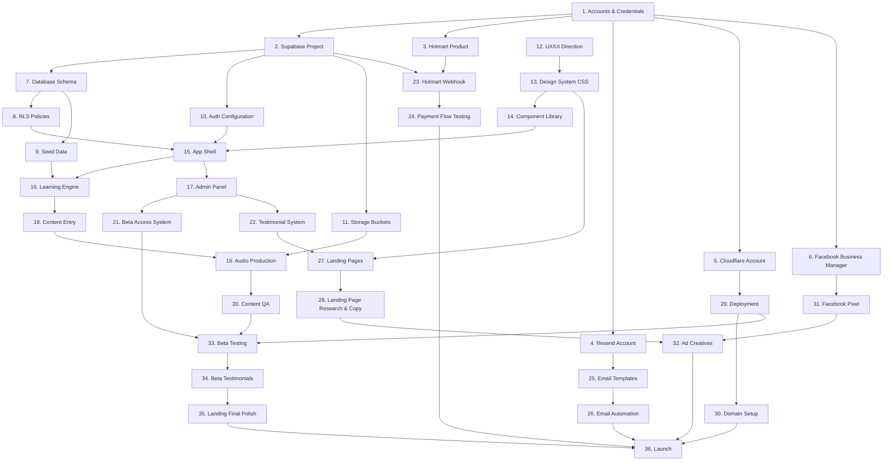

# Setup Dependency Map — English for Work

> This file shows what depends on what.
> You MUST complete things in order. Skipping steps will cause failures.

## Dependency Chain



## Dependency table (linear reading order)

| # | Task | Depends on | Blocking for |
|---|---|---|---|
| 1 | Create accounts (Supabase, Hotmart, Resend, Cloudflare, Facebook) | Nothing | Everything |
| 2 | Create Supabase project | Accounts | Schema, Auth, Storage |
| 3 | Create Hotmart product | Accounts | Webhook, Payment testing |
| 4 | Set up Resend account | Accounts | Email templates |
| 5 | Set up Cloudflare account | Accounts | Deployment |
| 6 | Set up Facebook Business Manager | Accounts | Pixel, Ads |
| 7 | Apply database schema | Supabase | RLS, Seed data, App |
| 8 | Configure RLS policies | Schema | App security |
| 9 | Insert seed data (routes, modules, lessons) | Schema | Learning engine |
| 10 | Configure Supabase Auth | Supabase | App login |
| 11 | Create storage buckets | Supabase | Audio files |
| 12 | Generate UX/UI direction | Nothing (Antigravity) | Design system |
| 13 | Build design system CSS | UX direction | All components |
| 14 | Build component library | Design system | App pages |
| 15 | Build app shell (routing, layout, auth guard) | Components, Auth, RLS | All pages |
| 16 | Build learning engine | App shell, Seed data | Content entry |
| 17 | Build admin panel | App shell | Beta access, Testimonials |
| 18 | Enter full content (lessons, phrases, exercises) | Learning engine | Audio production |
| 19 | Produce all audio clips | Content, Storage buckets | Content QA |
| 20 | QA all content + audio | Audio production | Beta testing |
| 21 | Build beta access system | Admin panel | Beta testing |
| 22 | Build testimonial system | Admin panel | Landing pages |
| 23 | Build Hotmart webhook | Supabase, Hotmart product | Payment testing |
| 24 | Test payment flow end-to-end | Webhook | Launch |
| 25 | Create email templates | Resend | Email automation |
| 26 | Build email automation | Email templates | Launch |
| 27 | Build landing pages | Design system, Testimonials | Copy, Ads |
| 28 | Research & write landing copy | Landing pages built | Ads |
| 29 | Deploy to Cloudflare | Cloudflare account | Domain, Beta |
| 30 | Configure domain | Deployment | Launch |
| 31 | Install Facebook Pixel | Facebook BM | Ads |
| 32 | Create ad creatives | Pixel, Landing copy | Launch |
| 33 | Beta testing (5-7 days) | QA complete, Beta system, Deployed | Testimonials |
| 34 | Collect beta testimonials | Beta testing | Landing polish |
| 35 | Final landing polish with real testimonials | Beta testimonials | Launch |
| 36 | Launch (activate ads) | Everything above | — |

## Critical path

The longest dependency chain that determines minimum time to launch:

```
Accounts → Supabase → Schema → Seed Data → Learning Engine → Content Entry 
→ Audio Production → Content QA → Beta Testing → Beta Testimonials 
→ Landing Polish → Launch
```

**Estimated critical path: 5-6 weeks**

## Parallel work streams

These can happen simultaneously:

| Stream A (Product) | Stream B (Design) | Stream C (Marketing) | Stream D (Infrastructure) |
|---|---|---|---|
| Schema + RLS | UX direction | Hotmart setup | Cloudflare setup |
| Auth config | Design system | Landing research | Domain purchase |
| Learning engine | Component library | Ad copy drafts | Facebook BM setup |
| Content entry | App pages | Ad creatives | Pixel installation |
| Audio production | Landing pages | Campaign setup | Email setup |
| Admin panel | — | — | Webhook integration |
